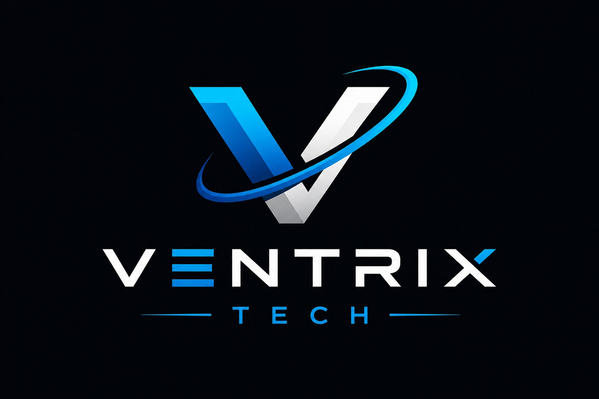

# BrenoFalcao.github.io
<!DOCTYPE html>
<html lang="pt-BR">
<head>
  <meta charset="UTF-8" />
  <meta name="viewport" content="width=device-width, initial-scale=1.0" />
  <meta name="description" content="Ventrix Tech – Especialista em Segurança Cibernética, Microsoft 365, redes e consultoria tecnológica para empresas." />
  <title>Ventrix Tech – Segurança Cibernética & Tecnologia</title>
  <link rel="stylesheet" href="style.css" />
  <link rel="preconnect" href="https://fonts.googleapis.com" />
  <link rel="preconnect" href="https://fonts.gstatic.com" crossorigin />
  <link href="https://fonts.googleapis.com/css2?family=Inter:wght@300;400;500;600;700;800;900&family=Space+Grotesk:wght@400;500;600;700&display=swap" rel="stylesheet" />
 <!-- EmailJS SDK -->
  
  

</head>
<body>

  <!-- NAVBAR -->
  <header class="navbar" id="navbar">
    

      
      <nav class="nav-links" id="nav-links" aria-label="Navegação principal">
        <a href="#servicos">Serviços</a>
        <a href="#sobre">Sobre</a>
        <a href="#diferenciais">Diferenciais</a>
        <a href="#contato">Contato</a>
      </nav>
      <a href="#contato" class="btn btn-primary nav-cta">Fale Conosco</a>
      <button class="hamburger" id="hamburger" aria-label="Abrir menu" aria-expanded="false">
        
      </button>
    

  </header>

  <!-- HERO -->
  <section class="hero" id="home">
    <canvas id="hero-canvas" aria-hidden="true"></canvas>
    

    

      

        
        Segurança Cibernética Avançada
      

      <h1 class="hero-title">
        Proteja e Evolua 
        Sua Empresa 
        com Tecnologia Real
      </h1>
      

        Da segurança cibernética ao Microsoft 365, redes e desenvolvimento web —
        a Ventrix Tech entrega soluções tecnológicas completas para impulsionar
        e blindar o seu negócio.
      

      

        <a href="#contato" class="btn btn-primary btn-lg">Solicitar Consultoria</a>
        <a href="#servicos" class="btn btn-ghost btn-lg">Ver Serviços</a>
      

      

        

          0+
          
Clientes Atendidos

        

        

        

          0%
          
Taxa de Satisfação

        

        

        

          0+
          
Anos de Experiência

        

      

    

    

      
    

  </section>

  <!-- SERVICES -->
  <section class="services" id="servicos">
    

      

        Nossos Serviços
        <h2 class="section-title">Soluções Completas para Sua Empresa</h2>
        

          Cobrimos todos os pilares da tecnologia corporativa moderna —
          do ambiente Microsoft à proteção contra ameaças digitais.
        

      

      

        

          

            <svg viewBox="0 0 24 24" fill="none" stroke="currentColor" stroke-width="1.5" aria-hidden="true">
              <path d="M12 22s8-4 8-10V5l-8-3-8 3v7c0 6 8 10 8 10z"/>
              <path d="m9 12 2 2 4-4"/>
            </svg>
          

          <h3 class="service-title">Segurança Cibernética</h3>
          

            Proteção avançada contra ameaças digitais, monitoramento contínuo, resposta a incidentes
            e estratégias de defesa para blindar os ativos da sua empresa.
          

          <ul class="service-list">
            <li>Análise de vulnerabilidades</li>
            <li>Monitoramento 24/7</li>
            <li>Resposta a incidentes</li>
          </ul>
          <a href="#contato" class="service-link">Saiba mais →</a>
        

        

          

            <svg viewBox="0 0 24 24" fill="none" stroke="currentColor" stroke-width="1.5" aria-hidden="true">
              <rect x="2" y="3" width="20" height="14" rx="2"/>
              <path d="M8 21h8M12 17v4"/>
              <path d="M7 8h.01M11 8h2M15 8h.01M7 12h2M11 12h.01M15 12h2"/>
            </svg>
          

          <h3 class="service-title">Microsoft 365</h3>
          

            Implementação, migração e gerenciamento completo do ecossistema Microsoft 365,
            maximizando produtividade e colaboração com segurança corporativa.
          

          <ul class="service-list">
            <li>Migração de dados</li>
            <li>Configuração de Exchange</li>
            <li>Teams & SharePoint</li>
          </ul>
          <a href="#contato" class="service-link">Saiba mais →</a>
        

        

          

            <svg viewBox="0 0 24 24" fill="none" stroke="currentColor" stroke-width="1.5" aria-hidden="true">
              <circle cx="12" cy="12" r="3"/>
              <path d="M12 2v3M12 19v3M2 12h3M19 12h3"/>
              <path d="m4.22 4.22 2.12 2.12M17.66 17.66l2.12 2.12M4.22 19.78l2.12-2.12M17.66 6.34l2.12-2.12"/>
            </svg>
          

          
Destaque

          <h3 class="service-title">Auditorias de Segurança</h3>
          

            Avaliações aprofundadas da postura de segurança da sua empresa, com relatórios
            detalhados e plano de ação para correção de vulnerabilidades críticas.
          

          <ul class="service-list">
            <li>Pentest & avaliações</li>
            <li>Relatórios executivos</li>
            <li>Plano de remediação</li>
          </ul>
          <a href="#contato" class="service-link">Saiba mais →</a>
        

        

          

            <svg viewBox="0 0 24 24" fill="none" stroke="currentColor" stroke-width="1.5" aria-hidden="true">
              <rect x="2" y="2" width="7" height="7" rx="1"/>
              <rect x="15" y="2" width="7" height="7" rx="1"/>
              <rect x="2" y="15" width="7" height="7" rx="1"/>
              <rect x="15" y="15" width="7" height="7" rx="1"/>
              <path d="M9 5.5h6M5.5 9v6M18.5 9v6M9 18.5h6"/>
            </svg>
          

          <h3 class="service-title">Redes Corporativas</h3>
          

            Configuração, estruturação e gerenciamento de infraestrutura de redes seguras,
            garantindo performance, disponibilidade e proteção dos dados trafegados.
          

          <ul class="service-list">
            <li>Redes Wi-Fi corporativas</li>
            <li>Firewall & VPN</li>
            <li>Monitoramento de rede</li>
          </ul>
          <a href="#contato" class="service-link">Saiba mais →</a>
        

        

          

            <svg viewBox="0 0 24 24" fill="none" stroke="currentColor" stroke-width="1.5" aria-hidden="true">
              <path d="M3 12l2-2m0 0l7-7 7 7M5 10v10a1 1 0 001 1h3m10-11l2 2m-2-2v10a1 1 0 01-1 1h-3m-6 0a1 1 0 001-1v-4a1 1 0 011-1h2a1 1 0 011 1v4a1 1 0 001 1m-6 0h6"/>
            </svg>
          

          <h3 class="service-title">Desenvolvimento Web</h3>
          

            Criação de websites e sistemas web modernos, responsivos e seguros,
            alinhados à identidade visual e objetivos estratégicos da sua empresa.
          

          <ul class="service-list">
            <li>Sites institucionais</li>
            <li>Sistemas web</li>
            <li>Otimização & SEO</li>
          </ul>
          <a href="#contato" class="service-link">Saiba mais →</a>
        

        

          

            <svg viewBox="0 0 24 24" fill="none" stroke="currentColor" stroke-width="1.5" aria-hidden="true">
              <path d="M17 21v-2a4 4 0 00-4-4H5a4 4 0 00-4 4v2"/>
              <circle cx="9" cy="7" r="4"/>
              <path d="M23 21v-2a4 4 0 00-3-3.87M16 3.13a4 4 0 010 7.75"/>
            </svg>
          

          <h3 class="service-title">Consultoria Tecnológica</h3>
          

            Orientação estratégica em tecnologia da informação para empresas de todos os portes,
            ajudando a tomar as melhores decisões para crescimento seguro e escalável.
          

          <ul class="service-list">
            <li>Diagnóstico de TI</li>
            <li>Planejamento estratégico</li>
            <li>Gestão de fornecedores</li>
          </ul>
          <a href="#contato" class="service-link">Saiba mais →</a>
        

      

    

  </section>

  <!-- ABOUT -->
  <section class="about" id="sobre">
    

      

        

          
          

        

        

          <svg viewBox="0 0 24 24" fill="none" stroke="currentColor" stroke-width="1.5" aria-hidden="true"><path d="M12 22s8-4 8-10V5l-8-3-8 3v7c0 6 8 10 8 10z"/></svg>
          ISO 27001 Ready
        

        

          <svg viewBox="0 0 24 24" fill="none" stroke="currentColor" stroke-width="1.5" aria-hidden="true"><circle cx="12" cy="12" r="10"/><path d="m9 12 2 2 4-4"/></svg>
          Microsoft Partner
        

      

      

        Sobre a Ventrix Tech
        <h2 class="section-title">Tecnologia que Protege e Transforma</h2>
        

          A Ventrix Tech nasceu com um propósito claro: oferecer às empresas o que há de mais moderno
          em segurança cibernética e soluções tecnológicas, com a agilidade de uma equipe especializada
          e o compromisso de um parceiro de confiança.
        

        

          Atendemos desde pequenas empresas que estão dando os primeiros passos digitais até grandes
          corporações que precisam fortalecer suas defesas. Nossa abordagem é sempre personalizada,
          técnica e orientada a resultados reais.
        

        

          

            

              <svg viewBox="0 0 24 24" fill="none" stroke="currentColor" stroke-width="2"><path d="M13 2L3 14h9l-1 8 10-12h-9l1-8z"/></svg>
            

            

              <h4>Agilidade</h4>
              
Respostas rápidas e implementações eficientes

            

          

          

            

              <svg viewBox="0 0 24 24" fill="none" stroke="currentColor" stroke-width="2"><path d="M12 22s8-4 8-10V5l-8-3-8 3v7c0 6 8 10 8 10z"/></svg>
            

            

              <h4>Segurança</h4>
              
Proteção de ponta a ponta para seus dados

            

          

          

            

              <svg viewBox="0 0 24 24" fill="none" stroke="currentColor" stroke-width="2"><circle cx="12" cy="12" r="10"/><path d="m9 12 2 2 4-4"/></svg>
            

            

              <h4>Confiança</h4>
              
Parceria transparente e suporte contínuo

            

          

        

      

    

  </section>

  <!-- WHY CHOOSE US -->
  <section class="why" id="diferenciais">
    

      

        Por que a Ventrix Tech?
        <h2 class="section-title">Nossos Diferenciais</h2>
        
O que nos torna a escolha certa para proteger e evoluir a sua empresa.

      

      

        

          
01

          <h3>Especialistas Certificados</h3>
          
Equipe com certificações reconhecidas em segurança cibernética, Microsoft e infraestrutura de TI.

        

        

          
02

          <h3>Atendimento Personalizado</h3>
          
Cada empresa é única. Desenvolvemos soluções sob medida para os desafios específicos do seu negócio.

        

        

          
03

          <h3>Suporte Ágil</h3>
          
Atendimento rápido e eficiente quando você mais precisa, minimizando impactos na sua operação.

        

        

          
04

          <h3>Visão Estratégica</h3>
          
Não somos só técnicos — ajudamos a alinhar tecnologia com os objetivos de negócio da sua empresa.

        

      

    

  </section>

  <!-- CTA BANNER -->
  <section class="cta-banner">
    

      

      <h2 class="cta-title">Pronto para Blindar Sua Empresa?</h2>
      

        Agende uma consultoria gratuita e descubra como a Ventrix Tech pode fortalecer
        a segurança e a infraestrutura tecnológica do seu negócio.
      

      <a href="#contato" class="btn btn-primary btn-lg">Agendar Consultoria Gratuita</a>
    

  </section>

  <!-- CONTACT -->
  <section class="contact" id="contato">
    

      

        Contato
        <h2 class="section-title">Vamos Conversar sobre Seu Projeto</h2>
        

          Entre em contato com a equipe Ventrix Tech. Estamos prontos para
          entender sua necessidade e oferecer a solução ideal.
        

        

          

            

              <svg viewBox="0 0 24 24" fill="none" stroke="currentColor" stroke-width="1.5"><path d="M22 16.92v3a2 2 0 01-2.18 2 19.79 19.79 0 01-8.63-3.07A19.5 19.5 0 013.07 9.81 19.79 19.79 0 01.03 1.18 2 2 0 012 .02h3a2 2 0 012 1.72c.127.96.361 1.903.7 2.81a2 2 0 01-.45 2.11L6.09 7.91a16 16 0 006 6l1.27-1.27a2 2 0 012.11-.45c.907.339 1.85.573 2.81.7A2 2 0 0122 14.92v2z"/></svg>
            

            

              <strong>WhatsApp</strong>
              Fale diretamente com nossa equipe
            

          

          

            

              <svg viewBox="0 0 24 24" fill="none" stroke="currentColor" stroke-width="1.5"><path d="M4 4h16c1.1 0 2 .9 2 2v12c0 1.1-.9 2-2 2H4c-1.1 0-2-.9-2-2V6c0-1.1.9-2 2-2z"/><polyline points="22,6 12,13 2,6"/></svg>
            

            

              <strong>E-mail</strong>
              contato@ventrixtech.com.br
            

          

          

            

              <svg viewBox="0 0 24 24" fill="none" stroke="currentColor" stroke-width="1.5"><circle cx="12" cy="12" r="10"/><polyline points="12 6 12 12 16 14"/></svg>
            

            

              <strong>Horário de Atendimento</strong>
              Segunda a Sexta, 8h às 18h
            

          

        

      

      <form class="contact-form" id="contact-form" novalidate>
        

          

            <label for="name">Nome completo</label>
            <input type="text" id="name" name="name" placeholder="Seu nome" required autocomplete="name" />
            
          

          

            <label for="company">Empresa</label>
            <input type="text" id="company" name="company" placeholder="Nome da empresa" autocomplete="organization" />
          

        

        

          

            <label for="email">E-mail</label>
            <input type="email" id="email" name="email" placeholder="seu@email.com.br" required autocomplete="email" />
            
          

          

            <label for="phone">Telefone / WhatsApp</label>
            <input type="tel" id="phone" name="phone" placeholder="Seu número" autocomplete="tel" />
          

        

        

          <label for="service">Serviço de interesse</label>
          <select id="service" name="service">
            <option value="">Selecione um serviço</option>
            <option value="cybersecurity">Segurança Cibernética</option>
            <option value="m365">Microsoft 365</option>
            <option value="audit">Auditoria de Segurança</option>
            <option value="network">Redes Corporativas</option>
            <option value="web">Desenvolvimento Web</option>
            <option value="consulting">Consultoria Tecnológica</option>
          </select>
        

        

          <label for="message">Mensagem</label>
          <textarea id="message" name="message" rows="4" placeholder="Descreva brevemente o que você precisa..." required></textarea>
          
        

        <button type="submit" class="btn btn-primary btn-full">
          Enviar Mensagem
          
        </button>
        

          <svg viewBox="0 0 24 24" fill="none" stroke="currentColor" stroke-width="2" aria-hidden="true"><circle cx="12" cy="12" r="10"/><path d="m9 12 2 2 4-4"/></svg>
          Mensagem enviada! Em breve entraremos em contato.
        

      </form>
    

  </section>

  <!-- FOOTER -->
  <footer class="footer">
    

      

        
        
Especialista em Segurança Cibernética e Soluções Tecnológicas para empresas.

        

          <a href="https://www.linkedin.com/company/136115859/admin/dashboard/" target="_blank" rel="noopener noreferrer" aria-label="LinkedIn" class="social-link">
            <svg viewBox="0 0 24 24" fill="currentColor" aria-hidden="true"><path d="M16 8a6 6 0 016 6v7h-4v-7a2 2 0 00-2-2 2 2 0 00-2 2v7h-4v-7a6 6 0 016-6zM2 9h4v12H2z"/><circle cx="4" cy="4" r="2"/></svg>
          </a>
          <a href="https://www.instagram.com/ventrixtechpt/" target="_blank" rel="noopener noreferrer" aria-label="Instagram" class="social-link">
            <svg viewBox="0 0 24 24" fill="none" stroke="currentColor" stroke-width="1.5" aria-hidden="true"><rect x="2" y="2" width="20" height="20" rx="5"/><path d="M16 11.37A4 4 0 1112.63 8 4 4 0 0116 11.37z"/><path d="M17.5 6.5h.01"/></svg>
          </a>
          <a href="https://wa.me/35196356492" target="_blank" rel="noopener noreferrer" aria-label="WhatsApp" class="social-link">
            <svg viewBox="0 0 24 24" fill="currentColor" aria-hidden="true"><path d="M17.472 14.382c-.297-.149-1.758-.867-2.03-.967-.273-.099-.471-.148-.67.15-.197.297-.767.966-.94 1.164-.173.199-.347.223-.644.075-.297-.15-1.255-.463-2.39-1.475-.883-.788-1.48-1.761-1.653-2.059-.173-.297-.018-.458.13-.606.134-.133.298-.347.446-.52.149-.174.198-.298.298-.497.099-.198.05-.371-.025-.52-.075-.149-.669-1.612-.916-2.207-.242-.579-.487-.5-.669-.51-.173-.008-.371-.01-.57-.01-.198 0-.52.074-.792.372-.272.297-1.04 1.016-1.04 2.479 0 1.462 1.065 2.875 1.213 3.074.149.198 2.096 3.2 5.077 4.487.709.306 1.262.489 1.694.625.712.227 1.36.195 1.871.118.571-.085 1.758-.719 2.006-1.413.248-.694.248-1.289.173-1.413-.074-.124-.272-.198-.57-.347m-5.421 7.403h-.004a9.87 9.87 0 01-5.031-1.378l-.361-.214-3.741.982.998-3.648-.235-.374a9.86 9.86 0 01-1.51-5.26c.001-5.45 4.436-9.884 9.888-9.884 2.64 0 5.122 1.03 6.988 2.898a9.825 9.825 0 012.893 6.994c-.003 5.45-4.437 9.884-9.885 9.884m8.413-18.297A11.815 11.815 0 0012.05 0C5.495 0 .16 5.335.157 11.892c0 2.096.547 4.142 1.588 5.945L.057 24l6.305-1.654a11.882 11.882 0 005.683 1.448h.005c6.554 0 11.89-5.335 11.893-11.893a11.821 11.821 0 00-3.48-8.413z"/></svg>
          </a>
        

      

      

        <h4>Serviços</h4>
        <ul>
          <li><a href="#servicos">Segurança Cibernética</a></li>
          <li><a href="#servicos">Microsoft 365</a></li>
          <li><a href="#servicos">Auditorias de Segurança</a></li>
          <li><a href="#servicos">Redes Corporativas</a></li>
          <li><a href="#servicos">Desenvolvimento Web</a></li>
          <li><a href="#servicos">Consultoria Tecnológica</a></li>
        </ul>
      

      

        <h4>Empresa</h4>
        <ul>
          <li><a href="#sobre">Sobre Nós</a></li>
          <li><a href="#diferenciais">Diferenciais</a></li>
          <li><a href="#contato">Contato</a></li>
        </ul>
      

    

    

      

        
&copy;  Ventrix Tech. Todos os direitos reservados.

        
Especialista em Segurança Cibernética

      

    

  </footer>

  
</body>
</html>
